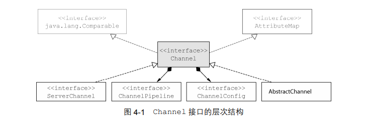
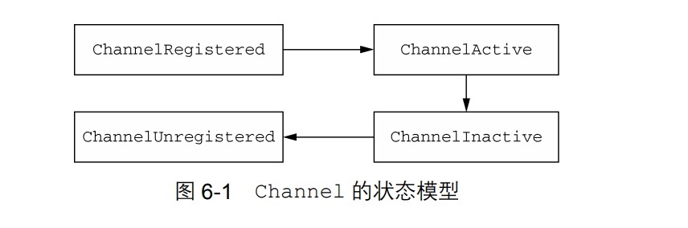
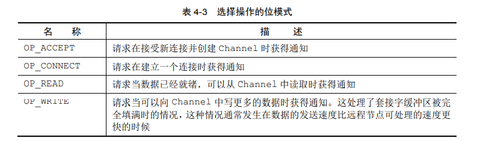
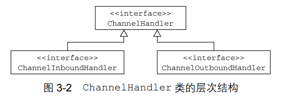
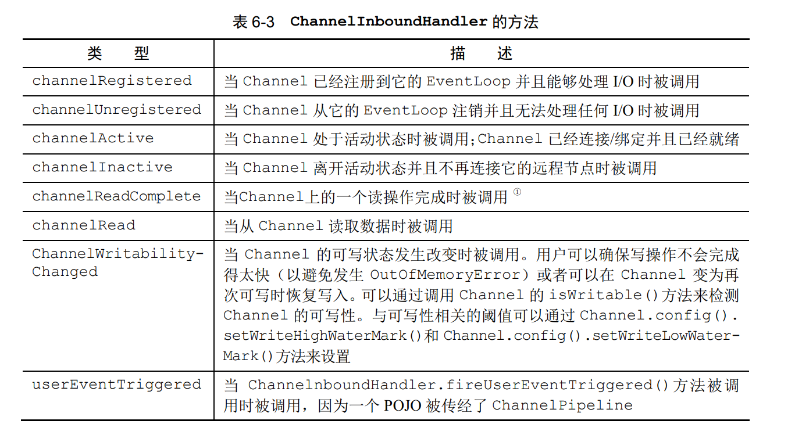
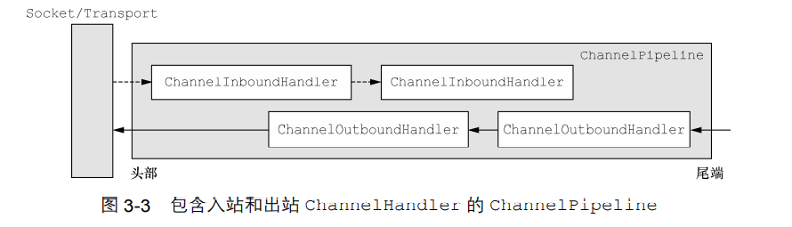
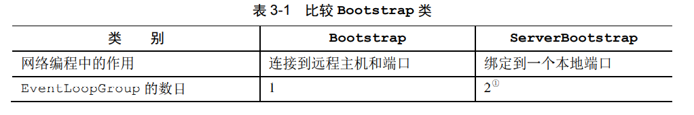
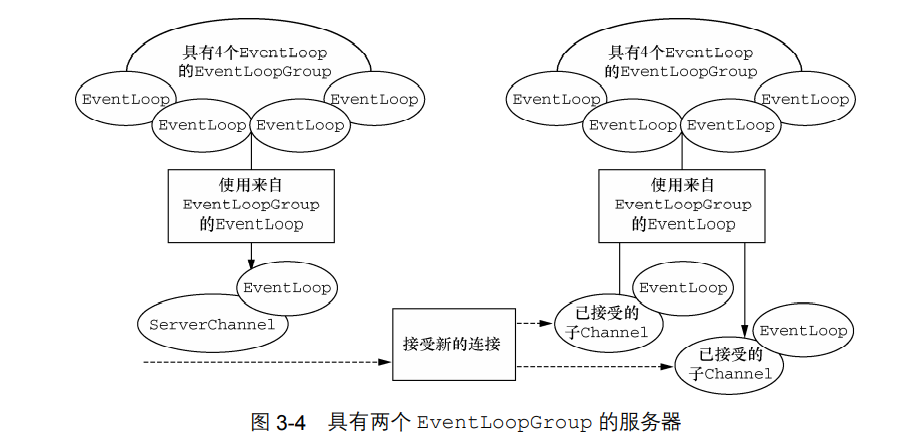

# Netty in Action

netty实战的demo


## Netty的组件和设计

### channel

基本的I/O操作.

常用的类:

- EmbeddedChannel 

- LocalServerChannel

- NioDatagramChannel

- NioSctpChannel 

- NioSocketChannel




Netty 的 Channel 实现是**线程安全**的


#### 生命周期

| 状 态               | 描 述                                                        |
| ------------------- | ------------------------------------------------------------ |
| ChannelUnregistered | Channel 已经被创建，但还未注册到 EventLoop                   |
| ChannelRegistered   | Channel 已经被注册到了 EventLoop                             |
| ChannelActive       | Channel 处于活动状态（已经连接到它的远程节点）。它现在可以接收和发送数据了 |
| ChannelInactive     | Channel 没有连接到远程节点                                   |



#### 状态

- 新的 Channel 已被接受并且就绪;

- Channel 连接已经完成;

- Channel 有已经就绪的可供读取的数据;

- Channel 可用于写数据。




### eventLoop

- 一个 EventLoopGroup 包含一个或者多个 EventLoop   **1:N**

- 一个 EventLoop 在它的生命周期内只和一个 Thread 绑定,   **1:1**

- 所有由 EventLoop 处理的 I/O 事件都将在它专有的 Thread 上被处理

- 一个 Channel 在它的生命周期内只注册于一个 EventLoop

- 一个 EventLoop 可能会被分配给一个或多个 Channel。**1:N**

对同一个channel的I/O操作都是使用同一个EventLoop, **既同一个Thread**


如果要使用 epoll 替代 NIO，只需要将 NioEventLoopGroup 替换为 EpollEventLoopGroup ，并且将 NioServerSocketChannel.class 替换为 EpollServerSocketChannel.class

### channelFuture


### channelHandler

充当了所有 处理入站和出站数据的应用程序逻辑的容器




在 Netty 中，有两种发送消息的方式:

1. 你可以直接写到 Channel 中，将会导致消息从ChannelPipeline 的尾端开始流动 **(直接跳过后续的channelHandler)**
2. 也可以写到和 ChannelHandler相关联的ChannelHandlerContext对象中。将导致消息从 ChannelPipeline 中的下一个 ChannelHandler 开始流动。


常用的适配器类:

-  ChannelHandlerAdapter

-  ChannelInboundHandlerAdapter

-  ChannelOutboundHandlerAdapter

-  ChannelDuplexHandler


#### channelHandler的子类型

##### 编码器/解码器

严格地说，其他的处理器也可以完成编码器和解码器的功能。
但是，正如有用来简化 ChannelHandler 的创建的适配器类一样，所有由 Netty 提供的编码器/解码器适配器类都实现 了 ChannelOutboundHandler 或者 ChannelInboundHandler 接口


##### `SimpleChannelInboundHandler<T>`

**只关注T类型的消息**

在这种类型的 ChannelHandler 中，最重要的方法是 channelRead0(ChannelHandlerContext,T)。除了要求不要阻塞当前的 I/O 线程之外，其具体实现完全取决于你

SimpleChannelInboundHandler 会自动释放资源


##### channelInboundHandler

1. channelRead()   对于每个传入的消息都要调用;
2. channelReadComplete()  通知ChannelInboundHandler最后一次对channelRead()的调用是当前批量读取中的最后一条消息;
3. exceptionCaught()  在读取操作期间，有异常抛出时会调用。



当某个 ChannelInboundHandler 的实现重写 channelRead()方法时，它将负责显式地 释放与池化的 ByteBuf 实例相关的内存。Netty 为此提供了一个实用方法 ReferenceCountUtil.release()

```java
@Sharable
public class DiscardHandler extends ChannelInboundHandlerAdapter { 
	@Override
	public void channelRead(ChannelHandlerContext ctx, Object msg) { 
		ReferenceCountUtil.release(msg);
 	} 
} 
```


### channelPipeline

链接多个channelHandler

客户端角度:



### bootstrap

有两种类型的bootstrap

1. 用于客户端(Bootstrap)
2. 用于服务器(ServerBootstrap)





### ByteBuf

- 它可以被用户自定义的缓冲区类型扩展;
- 通过内置的复合缓冲区类型实现了透明的零拷贝;
- 容量可以按需增长（类似于 JDK 的 StringBuilder）;
- 在读和写这两种模式之间切换不需要调用 ByteBuffer 的 flip()方法;
- 读和写使用了不同的索引; 
- 支持方法的链式调用;
- 支持引用计数
- 支持池化

slice()后调用retain(), 然后由切片维护内存

**只有copy()才返回深拷贝**

- duplicate();
- slice();
- slice(int, int);
- Unpooled.unmodifiableBuffer(…);
- order(ByteOrder);
- readSlice(int)。

#### ByteBufAllocator (池化)

可以通过 Channel（每个都可以有一个不同的 ByteBufAllocator 实例）或者绑定到 ChannelHandler 的 ChannelHandlerContext 获取一个到 ByteBufAllocator 的引用。

```java
Channel channel = ...;
ByteBufAllocator allocator = channel.alloc();
ChannelHandlerContext ctx = ...;
ByteBufAllocator allocator2 = ctx.alloc();
```


#### ByteBufUtil 

与处理ByteBuf相关的实用方法的集合，例如生成十六进制转储和交换整数的字节顺序

